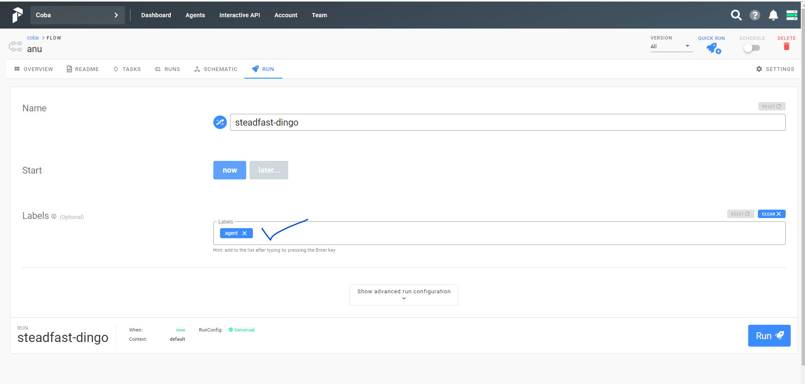

# What is this

An attempt to run `MySQLFetchTask` in Prefect1.

# Some notes

- To emulate `PrefectSecret`, you need to set `PREFECT__CONTEXT__SECRETS__<SECRET_NAME>` environment in `prefect-agent` container. See `docker-compose.yaml`
- When running a flow, make sure you give the same label as the agent. See picture



# Prepare

```bash
# preparation
if [ ! -d "venv" ]
then
    python -m venv venv
fi
source venv/bin/activate
pip install -r requirements.txt

# run docker compose
docker-compose down
docker-compose up --build
```

# Create tenant and project

```bash
# (venv should be activated)
# create tenant and object
prefect backend server
prefect server create-tenant --name coba
prefect create project coba
```


# Register flow

```bash
# (venv should be activated)
prefect backend server
prefect register --project "coba" --path flows/sample.py
```

# Run flow manually on the container

```bash
docker exec -it prefect-agent /bin/bash
```

# Run local agent on the host

```bash
# (venv should be activated)
prefect backend server
export PREFECT__CONTEXT__SECRETS__MYSQL_HOST=localhost
export PREFECT__CONTEXT__SECRETS__MYSQL_USER=root
export PREFECT__CONTEXT__SECRETS__MYSQL_PASSWORD=toor
export PREFECT__CONTEXT__SECRETS__MYSQL_DATABASE=sample
prefect agent local start --api "http://localhost:4200/api"
```
